# 00. 현황 인벤토리

> 이 문서는 사실만 기록한다. 판단과 요구사항은 01-requirements.md 이후에서 다룬다.
> 본 인벤토리는 구현이 끝난 뒤 정식화(retrofit)된 문서다.

작성 시점: 2026-09-22. 작성 브랜치: `req-retrofit`(tip `e2a54b4`).

이 문서의 모든 행에는 근거가 붙어 있다. 근거는 셋 중 하나다 —
커밋 해시(두 저장소 중 어디인지 명시), 파일 경로(코드·설정·마이그레이션·문서), 실행 출력.
확인하지 않은 것은 "확인하지 않음"이라고 적는다.

두 저장소를 쓴다.

| 약칭 | 경로 | 언어 | 기간 |
|---|---|---|---|
| **JAVA** | `/Users/antaeho/workspace/projects/credit_system` | Java | 2026-07-04 `7140bda` ~ 2026-09-03 `886430c` |
| **KT** | `/Users/antaeho/workspace/projects/credit-system-kotlin` | Kotlin | 2026-08-20 `5d39be6` ~ 2026-09-20 `e2a54b4` |

두 저장소의 기간은 2026-08-20 ~ 09-03 구간에서 겹친다. JAVA 의 마지막 커밋
`886430c`(2026-09-03, "refactor: drop the redis outage gate from heartbeat recovery")는
KT 이식이 시작된(2026-08-20) 뒤에 찍혔다.

---

## 1. 구현 히스토리 복원

이 절은 **시스템이 실제로 무엇에서 무엇으로 바뀌었는가**를 날짜 구간으로 나눈다.
저장소에 남아 있는 교육용 단계 구분(step 번호)은 구성 축으로 쓰지 않는다(부록 C 참조).
커밋 메시지에 `step7-3` 같은 접두사가 붙어 있는 것은 사실이므로 해시 옆에 그대로 남긴다.

KT 저장소의 `git log` 만 보면 Kafka 도입·제거가 보이지 않는다.
그 사건들은 전부 JAVA 저장소에 있고, KT 의 첫 커밋 `5d39be6` 은 **이미 Kafka 가 제거되고
`jobs` 테이블이 작업 큐가 된 뒤의 상태**를 고정한 것이다.

### 1-1. 2026-07-04 ~ 2026-09-03 — Kafka·outbox 파이프라인에서 DB 작업 큐로 (JAVA)

JAVA 저장소 전체 커밋은 **95 개**다(`git rev-list --count HEAD`, 2026-07-04 ~ 2026-09-03).
아래는 구조가 바뀐 전환점과 Kafka 연대기 전부다.
이 구간의 가장 큰 변화는 2026-08-17 이다 — 작업 전달 수단이 **Kafka 토픽 + outbox relay + DLT** 에서
**`jobs` 테이블 폴링 + attemptNo CAS** 로 바뀌었다. 08-17 이후의 행(08-19 ~ 09-03)은
그 DB 작업 큐 위에서 이뤄진 후속 정리이고, 그 상태가 그대로 Kotlin 으로 이식됐다.

| 해시(JAVA) | 날짜 | 사건 |
|---|---|---|
| `7140bda` | 2026-07-04 | Initial commit: Spring Boot 프로젝트 스캐폴드 |
| `104c30d` | 2026-07-04 | Organization/Ledger 엔티티와 조건부 UPDATE 리포지토리 |
| `5f32965` | 2026-07-04 | Job/IdempotencyKey/Outbox 엔티티, fencing token 쿼리 |
| `2d1a2d3` | 2026-07-04 | outbox writer 와 JSON payload 계약 |
| `2d9b360` | 2026-07-04 | HoldService 와 job 생성/목록 API |
| **`073163c`** | **2026-07-04** | **outbox relay 가 Kafka 로 발행 (KafkaTopicConfig, OutboxRelay 신설)** |
| **`9f571a2`** | **2026-07-04** | **Redis heartbeat + Kafka generation worker** |
| `ebbfb67` | 2026-07-05 | 재시도/환불 서비스와 dead-job 스케줄러 |
| `4632f56` | 2026-07-05 | 낙관적 락 재시도 루프를 원자적 조건부 잔액 UPDATE 로 교체 |
| **`42ccb4d`** | **2026-07-05** | **broker ack 로 outbox 전달 보장, 정체 HOLDING 회수** |
| **`d3cbe73`** | **2026-07-06** | **poison message 를 DLT 로 격리, 정체 PROCESSING 회수 (KafkaConsumerConfig)** |
| **`89d0ecb`** | **2026-07-06** | **H2 를 test scope 로 내리고 Kafka 파티션·컨슈머 동시성 설정 정렬** |
| `82a2261` | 2026-07-06 | attachJobId 결과 검증, BaseEntity 추출, HoldService 책임 분리 |
| `bae1810` | 2026-07-15 | job 전이 불변식 강제 |
| **`3478b8d`** | **2026-07-15** | **broker 장애 시 attempt 소모 방지, heartbeat 누수 수정, 입력 경계** |
| `cee4bf8` | 2026-08-02 | 잔액 전략 벤치마크 설계 문서 |
| **`00b2b34`** | **2026-08-17** | **Kafka·outbox·DLT 제거, `jobs` 테이블을 작업 큐로** |
| `1e8301b` | 2026-08-17 | DB job 폴링 단순화 |
| `dfee576` | 2026-08-17 | bounded batch 처리 |
| **`02ba3f7`** | **2026-08-17** | **전용 bounded executor 도입** |
| `a02db15` | 2026-08-17 | 장기 Redis 장애가 회수를 막는 상황을 표면화 |
| **`4628f51`** | **2026-08-17** | **README·문서를 Kafka 파이프라인이 아니라 DB 잡큐 기준으로 갱신** |
| `8e37509` | 2026-08-19 | 세션 로그인과 대시보드 제거, org 헤더로 대체 |
| `021dc82` | 2026-08-19 | hold 이후 네 서비스를 JobLifecycleService 로 통합 |
| `32180c1` | 2026-08-19 | Semaphore 제거, executor 거부가 주기를 끊게 |
| `18d3b19` | 2026-08-19 | 조직별 잔액 대사 도입 |
| `24bbfd4` | 2026-08-19 | 멱등키 보존 기간 만료 |
| `33e3c54` | 2026-08-20 | heartbeat 를 attempt 단위로 키잉 |
| `a2eef5a` | 2026-08-20 | batch-size 효과 측정(벤치마크) |
| `0880061` | 2026-08-20 | 워커 설정이 함의하는 처리량 상한을 로그로 |
| `886430c` | 2026-09-03 | heartbeat 회수에서 Redis outage gate 제거 (JAVA 마지막 커밋) |

`00b2b34` 의 변경 규모: **34 files changed, 198 insertions(+), 860 deletions(-)**
(`git show --stat 00b2b34`). 삭제된 파일에는 `outbox` 패키지 전체
(`OutboxRelay`, `OutboxWriter` 와 그 테스트들)와 `src/test/resources/application-test.yml` 이 포함된다.

**제거 근거의 1차 자료**는 `/Users/antaeho/workspace/projects/credit_system/docs/db-job-queue-refactor.md` 다.
이 파일은 지금도 JAVA 워킹트리에 존재한다. "보장 경계" 절 전문:

> 크레딧 차감, job 생성, ledger 기록은 하나의 RDB 트랜잭션이다. 작업 큐도 같은 DB에 있으므로 DB와 Kafka 사이의 이중 쓰기·outbox 재발행 문제가 없다. 여러 워커가 있어도 `HOLDING → PROCESSING` 조건부 UPDATE와 attemptNo fencing으로 하나의 시도만 결과를 반영한다. `jobs(status, id)` 인덱스는 배치 폴링의 상태 필터와 ID 정렬을 지원한다.
>
> `HOLDING`은 메시지 발행 실패가 아닌 정상적인 DB 대기열 상태이므로, 경과 시간만으로 실패·환불 처리하지 않는다. worker가 중지된 상태에서 남은 HOLDING job은 worker가 다시 기동되면 처리된다.
>
> Redis는 작업 전달 수단이 아니라 살아있는 처리 작업을 확인하는 heartbeat 저장소로만 남는다. Redis 장애 시 기존 보수적 회수 정책을 유지한다.

같은 문서의 처리 흐름 5번 항목은 결과 반영 실패의 귀결을 이렇게 적어 뒀다:

> 성공하면 `COMPLETED`, 외부 생성 실패는 `FAILED`로 기록한다. 결과 DB 반영 실패는 짧게 재시도하고, 그래도 실패하면 `PROCESSING`에 남겨 timeout 회수 경로에 맡긴다. 이때 중복 생성이 차단되는 것은 아니고 회수 시점까지 지연될 뿐이며, 이미 만들어진 결과 URL은 유실된다.

이 문서가 Phase 2 의 ADR-001/ADR-002 가 인용할 1차 자료로 **존재한다**는 사실을 여기 남긴다.
제거의 타당성 평가는 이 문서의 범위 밖이다.

### 1-2. 2026-08-20 ~ 2026-08-25 — Kotlin 이식과 구조 정리 (KT)

`5d39be6`(첫 커밋)부터 `8f6aad2`(현재 `main` tip)까지 **41 개** 커밋(`git rev-list --count 8f6aad2`).
대부분은 Java 구현의 Kotlin 이식, 테스트 이식, 패키지·서비스 경계 재조정이다.
그 안에 동작 변경도 있다 — confirm 재시도 제거(`a6ada3e`, `83873ac`),
멱등키 정리 주기를 1시간에서 새벽 2시 cron 으로(`bbd5019`),
회수 작업의 항목별 격리와 heartbeat 생성자 복원(`9d5ec6d`).
아래는 "도입 후 제거/되돌림"이 일어난 전환점이다.

| 해시(KT) | 날짜 | 사건 |
|---|---|---|
| `5d39be6` | 2026-08-20 | 코틀린 이식 현재 상태를 첫 커밋으로 고정 (Kafka 없음, DB 잡큐 상태) |
| `10932b4` | 2026-08-20 | 벤치마크를 이식 — 이식 작업 완료 |
| **`1c9a878`** | **2026-08-20** | **벤치마크를 삭제한다** (이식 5일 뒤 제거) |
| `7b05243` / `965ab39` | 2026-08-21 | ktlint / detekt 를 위생 검사로 부착 |
| `b7fc054` | 2026-08-21 | confirm 재시도를 "다시 시도할 값어치가 있는 예외"로 좁힘 |
| `6d28e0a` | 2026-08-24 | scheduler 봉지를 해체해 역할별 재배치 |
| **`a6ada3e`** | **2026-08-24** | **안정성에 기여하지 않는 곁가지를 걷어낸다** |
| **`83873ac`** | **2026-08-24** | **곁가지 정리의 판단 기준과 confirm 재시도를 포기한 대가를 report.md P 절에 기록** |
| `83d6dd3` | 2026-08-24 | RedisOutageGate 를 HeartbeatRegistry 안으로 흡수 |
| **`fbb6a5c`** | **2026-08-24** | **파일과 패키지를 합쳐 구조를 평탄화한다** |
| `2df3725` | 2026-08-24 | JPQL 에서 FQ 패키지명 제거, 중복 쿼리 제거 |
| **`db4dd89`** | **2026-08-24** | **JPQL FQ 이름 제거와 QueryDSL 을 쓰지 않기로 한 근거를 report.md R 절에 기록** |
| **`e8f48a4`** | **2026-08-25** | **Revert "refactor: 파일과 패키지를 합쳐 구조를 평탄화한다"** (`fbb6a5c` 되돌림) |
| **`bd14986`** | **2026-08-25** | **평탄화를 되돌린 이유와 무엇을 단순화해야 했는지를 report.md S 절에 기록** |
| `a98a99f` | 2026-08-25 | IdempotencyProperties 를 AppProperties 안으로 접음 |
| `bbd5019` | 2026-08-25 | 멱등키 정리를 1시간 주기 → 새벽 2시 cron 으로 변경 |
| `8f6aad2` | 2026-08-25 | job 상태 전이 명명, 조직 조회 중복 통합 (현재 `main` tip) |

**각주 — `report.md` 는 워킹트리에 없다.**
위 표의 `83873ac`, `db4dd89`, `bd14986` 등이 근거로 가리키는 `report.md`(2008 줄)는
현재 어느 브랜치의 워킹트리에도 없다. `589c696`(step0, 2026-08-30)에서 삭제됐다 —
`git show --stat 589c696 -- report.md` 는 `1 file changed, 2008 deletions(-)` 를 출력한다.
내용은 `git show 589c696^:report.md` 로 읽을 수 있다(2008 줄, `wc -l` 확인).
Phase 2 의 ADR 이 이 파일의 P·Q·R·S 절을 인용하려면 이 경로를 써야 한다.

### 1-3. 2026-09-05 ~ 2026-09-06 — 관측 계측이 붙는다 (KT)

이 구간에서 도메인 상태와 방어 장치의 동작이 처음으로 지표가 됐다.
직전 커밋 시점(`98a5bab^`)의 `build.gradle.kts` 에는 actuator·micrometer·prometheus
의존성 줄이 없고, `observability` 패키지도 없다
(`git show 98a5bab^:build.gradle.kts`, `git ls-tree -r --name-only 98a5bab^`).

| 해시(KT) | 날짜 | 시스템에 생긴 것 |
|---|---|---|
| `98a5bab` (`step7-1`) | 2026-09-05 | 원장 대사 결과를 지표로 승격 (`LedgerReconciliationMetrics`) |
| `88b3325` (`step7-2`) | 2026-09-05 | 방어 발동 카운터 — 0 행을 세어 방어 장치의 가동을 기록 (`DefenseMetrics`) |
| `f05c79f` (`step7-3`) | 2026-09-05 | 상태 스냅샷 게이지 — 미결 수·금액·나이를 DB 에 직접 묻는 `DomainSnapshotTask` |
| `8101bcc` (`step7-4,5`) | 2026-09-05 | 관리 포트 노출 경계와 카디널리티 가드(`MetricsCardinalityConfig`), Prometheus·Grafana compose |
| `dc8dd23` (`step7-6`) | 2026-09-05 | 장애 주입 시나리오 스크립트 |
| `9e8ff0b` | 2026-09-05 | 백스톱이 Redis 없이도 도는 경로 (`BACKSTOP_BLIND`) |
| `e2c489c` | 2026-09-05 | 디스패처가 빈 슬롯 수만큼만 선점하도록 변경 (`WorkerSlots`) |
| `b9bb5ca` | 2026-09-06 | 장애 주입 버튼 패드 (`deploy/observability/faultpad/`) |

### 1-4. 2026-09-10 — 운영 기반: Flyway·Docker·CI (KT)

이 구간에서 스키마 관리 주체가 Hibernate `ddl-auto` 에서 Flyway 마이그레이션으로 바뀌고,
빌드가 노트북 밖(GitHub Actions)에서도 돌게 됐다.

| 해시(KT) | 날짜 | 시스템에 생긴 것 |
|---|---|---|
| `4cfe6ff` | 2026-09-10 | 로드맵 v2 문서 |
| `6e1fc74` (`step8-A`) | 2026-09-10 | **Flyway 도입**(`V1__baseline.sql`), `ddl-auto: validate` 로 전환, 설정·비밀 분리 |
| `b804f32` (`step8-C`) | 2026-09-10 | 루트 `Dockerfile`·`docker-compose.yml`, GitHub Actions 워크플로 |
| `c3bdda2` (`step8-D`) | 2026-09-10 | 관측 스택의 DB 자격증명을 루트 compose 계약으로 통일 |
| `bdae77a` (`step8-E`) | 2026-09-10 | README 와 실행 문서 |
| `fd7924c` | 2026-09-10 | CI 첫 실행 결과 기록 |
| — | 2026-09-14 | **종료 드레인 구현이 이 묶음에서 빠져 `step8-b-drain-archive` 브랜치(tip `bf26660`)에 보관됐다.** 근거는 `docs/roadmap.md` 변경 이력의 2026-09-14 줄: "배포 환경이 없는 시점에 검증할 수 없는 코드였고 … 드레인 구현은 step8-b-drain-archive 브랜치에 보존" |

### 1-5. 2026-09-19 ~ 2026-09-20 — 조직에서 개인 사용자로, 헤더에서 인증으로 (KT)

이 구간에서 계정 단위가 `organizations` 에서 `users` 로 바뀌고,
신원의 출처가 HTTP 헤더에서 Google OIDC 세션으로 바뀌었다.
결제 없는 자기 충전 API 가 사라지고 운영자 지급으로 대체됐다.

| 해시(KT) | 날짜 | 시스템에 생긴 것 |
|---|---|---|
| `a4bfb9f` | 2026-09-19 | 로드맵 v3 — 대상을 조직에서 개인 사용자로 전환하는 결정 8~15 |
| `11cf99d` | 2026-09-19 | 로드맵 v4 — 작업 순서 재편(결정 16·17) |
| `c15cd23` (`step9-A`) | 2026-09-19 | `organizations` → `users` 이관 (`V2__organizations_to_users.sql`) |
| `ab67639` (`step9-B`) | 2026-09-19 | **구글 로그인 + 허용 목록.** 헤더로 받던 신원이 인증 주체가 된다 (`AllowlistOidcUserService`, `DevLoginFilter`) |
| `f90d80e` (`step9-C`) | 2026-09-19 | 자기 충전 API 제거, 운영자 지급으로 대체 (`V3__ledger_type_admin_grant.sql`, `ADMIN_GRANT`) |
| `8397fea` (`step9-E`) | 2026-09-19 | job 단건 조회와 커서 페이징 (`V4__jobs_user_id_index.sql`) |
| `eab84fb` (`step9-D`) | 2026-09-19 | 사용자별 job 접수 속도 제한 (도입) |
| `4b2a618` (`step9-F`) | 2026-09-19 | 서버 렌더링 최소 화면 — 로그인부터 결과 확인까지 |
| `78851f8` (`step9-G`) | 2026-09-20 | 관측 도구를 새 인증으로 이관 |
| **`4dcbbfe`** | **2026-09-20** | **revert — 사용자별 속도 제한을 전부 뺀다.** 근거는 `docs/roadmap.md` 2026-09-20 줄("총량은 잔액이, AI 호출 동시성은 워커 수가 이미 막고 … 테스트 291 → 276") |
| `b0a64d1` / `c1cb8c6` | 2026-09-20 | 브라우저 한 바퀴 / 실제 구글 계정 로그인 확인 (`c1cb8c6` = 현재 `develop` tip) |

### 1-6. 2026-09-20 — 외부 호출에 타임아웃·상한·backoff·드레인이 붙는다 (KT)

이 구간에서 외부 호출이 인터페이스 뒤로 들어가고, 그 호출이 돌아오지 않는 경우에
돈이 풀리는 경로가 만들어졌다. 현재 `req-retrofit` 워킹트리의 상태다.

| 해시(KT) | 날짜 | 시스템에 생긴 것 |
|---|---|---|
| `1e439e3` | 2026-09-20 | 배포 작업을 보류하고 이 묶음의 두 미결(절대 상한 값, 드레인 복원)을 확정한 문서 |
| `9494faa` (`step11-A`) | 2026-09-20 | `GenerationClient` 경계 신설, 호출에 타임아웃 (`app.generation.timeout-seconds: 20`) |
| `3075367` (`step11-B`) | 2026-09-20 | 백스톱 절대 상한 — 멈춘 워커의 돈을 푼다 (`absolute-timeout-seconds: 300`, `HARD_CAP`) |
| `e17ed27` (`step11-C`) | 2026-09-20 | 재시도 지수 backoff (`V5__jobs_next_attempt_at.sql`, `retry-backoff` 10초·4배) |
| `e512b76` (`step11-D`) | 2026-09-20 | 보관 브랜치의 종료 드레인 복원 (`GenerationWorkerLifecycle`, `WorkerDrainGate`) |
| `66e52e8` (`step11-E`) | 2026-09-20 | 요청 상관 ID·구조화 로그, 로그에서 프롬프트 제거 (`RequestIdFilter`, `LogContext`, prod ECS JSON) |
| `026bdab` (`step11-F`) | 2026-09-20 | 시나리오·알람을 새 동작에 맞춤 |
| `e2a54b4` | 2026-09-20 | 시나리오 8 개 재실행 실측 기록 (현재 `req-retrofit`·`step11-external` tip) |

### 1-7. 브랜치 상태

`git branch -v`, `git branch -r`:

| 브랜치 | tip | origin 에 있음 |
|---|---|---|
| `main` | `8f6aad2` | 예 |
| `develop` | `c1cb8c6` | 예 |
| `step11-external` | `e2a54b4` | **아니오(미푸시)** |
| `req-retrofit` (현재) | `e2a54b4` | **아니오(미푸시)** |
| `step8-b-drain-archive` | `bf26660` | 예 |

`req-retrofit` 과 `step11-external` 은 같은 커밋 `e2a54b4` 를 가리킨다.

### 1-8. Kafka 연대기 — 세 시점

| 시점 | 근거 | 사건 |
|---|---|---|
| 2026-07-04 | JAVA `073163c`, `9f571a2` | **도입.** outbox relay 가 Kafka 로 발행, Kafka generation worker |
| 2026-08-17 | JAVA `00b2b34` (34 files, −860 lines) + `docs/db-job-queue-refactor.md` | **제거.** Kafka·outbox·DLT 삭제, `jobs` 테이블을 작업 큐로 |
| 2026-09-10 | KT `docs/roadmap.md` "결정 1 — Kafka를 넣지 않는다 (2026-09-10)" | **재도입 거부.** 원문: "DB가 큐이고 상태 전이가 attemptNo CAS로 보호된다. 큐가 없어도 이중 처리가 안 난다는 게 step4~5의 논지다." |

현재 KT 워킹트리에 Kafka 관련 코드·설정·의존성은 없다(`build.gradle.kts`,
`src/main/resources/application*.yml`, `docker-compose.yml` 확인).

---

## 2. 현재 아키텍처

있는 것만 그린다. Kafka, PG, 실제 외부 AI API 는 현재 코드에 없으므로 그리지 않는다.

```mermaid
flowchart TB
    subgraph client["브라우저"]
        UI["Thymeleaf 화면 (home / job / ledger / admin / login)"]
    end

    subgraph app["Spring Boot 4.1.0 앱 (JVM 1 프로세스)"]
        direction TB
        P8080["앱 포트 8080 - API + 화면"]
        P8081["관리 포트 8081 - actuator health / info / prometheus"]

        subgraph auth["인증"]
            OIDC["AllowlistOidcUserService (Google OIDC + 허용 목록)"]
            DEV["DevLoginFilter (로컬 전용, 기본 꺼짐)"]
        end

        subgraph txHold["TX-1 HoldService.requestGeneration @Transactional"]
            H1["idem 조회/INSERT → deductBalance → jobs INSERT → attachJobId → ledger HOLD"]
        end

        DISP["GenerationWorker.dispatchPendingJobs (fixedDelay 500ms)"]
        EXEC["generationWorkerExecutor - core=max=3, queueCapacity=0"]
        PROC["GenerationJobProcessor.runGeneration (워커 스레드)"]

        subgraph txConfirm["TX-2 JobLifecycleService.confirm @Transactional"]
            C1["completeIfAttemptMatches CAS → ledger CONFIRM"]
        end
        subgraph txFailed["TX-3 markFailed @Transactional"]
            F1["failIfProcessing CAS"]
        end

        RECOV["DeadJobRecoveryTask.scan (fixedDelay 5000ms)"]
        subgraph txRetry["TX-4 retry @Transactional"]
            R1["incrementAttemptForRetry - attemptNo+1, HOLDING, nextAttemptAt"]
        end
        subgraph txRefund["TX-5 finalRefund @Transactional"]
            RF1["refundIfFailed CAS → addBalance → ledger REFUND"]
        end

        RECON["LedgerReconciliationTask.reconcile (fixedDelay 60000ms)"]
        SNAP["DomainSnapshotTask.takeSnapshot (fixedDelay 15000ms)"]
        CLEAN["IdempotencyKeyCleanupTask.cleanup (cron 0 0 2 * * * / Asia/Seoul)"]
        HBREG["HeartbeatRegistry - 자체 ScheduledExecutorService, 5초마다 갱신"]
    end

    EXT["GenerationClient.generate - 트랜잭션 밖, 워커 스레드"]
    STUB["GenerationStubClient (유일한 구현) - 실패율 0.3, 지연 3~7s, timeout 20s, hang 손잡이"]

    subgraph infra["Docker 컨테이너"]
        MYSQL[("MySQL 8.4 - users / jobs / ledger_entries / idempotency_keys / flyway_schema_history")]
        REDIS[("Redis 7 - ZSET 키 heartbeats 하나")]
    end

    subgraph obs["별도 compose - deploy/observability"]
        PROM["Prometheus v3.1.0"]
        GRAF["Grafana 11.5.1"]
        SCEN["시나리오 스크립트 01~08 + faultpad"]
    end

    UI --> P8080
    P8080 --> auth
    P8080 --> txHold
    txHold --> MYSQL
    DISP -->|"findDispatchableByStatus + startProcessingIfAttemptMatches CAS"| MYSQL
    DISP --> EXEC
    EXEC --> PROC
    PROC --> HBREG
    HBREG --> REDIS
    PROC --> EXT
    EXT --> STUB
    PROC --> txConfirm
    PROC --> txFailed
    txConfirm --> MYSQL
    txFailed --> MYSQL
    RECOV --> REDIS
    RECOV --> MYSQL
    RECOV --> txRetry
    RECOV --> txRefund
    txRetry --> MYSQL
    txRefund --> MYSQL
    RECON --> MYSQL
    SNAP --> MYSQL
    CLEAN --> MYSQL
    PROM -->|"scrape"| P8081
    GRAF --> PROM
    SCEN --> P8080
```



### 2-1. 그림이 말하는 사실들

**포트.** 앱 8080, 관리 8081(`application-local.yml` 의 `management.server.port: 8081`,
`Dockerfile` 의 `EXPOSE 8080 8081`, `docker-compose.yml` 의 `MANAGEMENT_SERVER_PORT: 8081`).
노출 엔드포인트는 `health,info,prometheus`(`application.yml` 의 `management.endpoints.web.exposure.include`).

**화면.** `PageController` 가 `/`(home), `/jobs/{id}`, `/ledger`, `/admin` 을,
`LoginPageController` 가 `/login` 을 담당한다. 템플릿은 `src/main/resources/templates/`
아래 `home.html`, `job.html`, `ledger.html`, `admin.html`, `login.html`, `fragments.html`,
`error.html`, `error/403.html`, `error/404.html`.

**API.** `/api/jobs`(POST 접수, GET 목록, GET `/{id}` 단건), `/api/ledger`(GET),
`/api/users/me/balance`(GET), `/api/admin/users/{userId}/grants`(POST).

**인증.** `auth/login/AllowlistOidcUserService.kt`(Google OIDC + `app.auth.allowed-emails`
허용 목록), `auth/login/DevLoginFilter.kt`(`app.auth.dev-login.enabled`, 기본 `false`).
`auth/config/AuthStartupGuard.kt` 가 prod 프로필에서 개발 로그인이 켜져 있거나
허용 목록이 비어 있거나 운영자 목록이 허용 목록의 부분집합이 아니면 기동을 거부한다.

**스케줄러 5종.** 전부 `spring.task.scheduling.pool.size: 4` 풀 위에서 돈다
(`application.yml`).

| 태스크 | 파일:메서드 | 주기 | 주기 값의 출처 |
|---|---|---|---|
| 디스패처 | `job/worker/GenerationWorker.kt:dispatchPendingJobs` | fixedDelay 500ms | `app.scheduling.worker-interval-millis:500` — **yml 에 키 없음, 애너테이션 기본값** |
| 회수 | `job/scheduling/DeadJobRecoveryTask.kt:scan` | fixedDelay 5000ms | `app.scheduling.dead-job-scan-interval-millis:5000` — **yml 에 키 없음, 애너테이션 기본값** |
| 원장 대사 | `ledger/scheduling/LedgerReconciliationTask.kt:reconcile` | fixedDelay 60000ms | `app.scheduling.reconciliation-interval-millis: 60000` (yml) |
| 도메인 스냅샷 | `global/scheduling/DomainSnapshotTask.kt:takeSnapshot` | fixedDelay 15000ms | `app.scheduling.snapshot-interval-millis: 15000` (yml) |
| 멱등키 정리 | `job/scheduling/IdempotencyKeyCleanupTask.kt:cleanup` | cron `0 0 2 * * *`, zone `Asia/Seoul` | `app.scheduling.idempotency-cleanup-cron`, `app.scheduling.timezone` (yml) |

`GenerationWorker` 는 `@ConditionalOnExpression("app.scheduling.enabled and app.worker.enabled")`,
나머지 넷은 `@ConditionalOnProperty(app.scheduling.enabled, matchIfMissing = true)` 로 켜진다.

**워커 실행.** `job/worker/WorkerExecutorConfig.kt` 의 `generationWorkerExecutor` 는
`ThreadPoolTaskExecutor` 이고 `corePoolSize = maxPoolSize = app.worker.concurrency(3)`,
`queueCapacity = 0`, `threadNamePrefix = "generation-worker-"`,
`waitForTasksToCompleteOnShutdown = true` 다. 같은 파일의 `workerSlots` 빈은
`maxPoolSize - activeCount` 를 돌려준다. 디스패처는 `minOf(batchSize(3), free)` 만큼만 조회한다
(`GenerationWorker.dispatchCycle`).

**이 설정이 함의하는 처리량 상한.** 동시 실행 3개, 한 건의 stub 지연 3~7초
(`app.stub.min-delay-millis: 3000`, `max-delay-millis: 7000`)이므로
`3 / 3~7초 ≈ 초당 0.43 ~ 1.0 건`이다. 타임아웃(`app.generation.timeout-seconds: 20`)까지
쓰는 건이 섞이면 더 내려간다. 설정값 산술이며 실측이 아니다.
같은 계산을 로그로 찍는 코드가 JAVA 저장소에는 있었으나(`0880061`, 2026-08-20
"feat: log the throughput ceiling the worker settings imply") KT 저장소에는 이식되지 않았다
(`grep -rn "상한\|ceiling" src/main/kotlin/.../job/worker/` 결과 드레인 상한 로그만 나온다).
접수(S1)는 이 상한과 무관하게 HTTP 요청마다 일어나므로, 접수율이 이 값을 넘으면
`HOLDING` job 이 DB 에 쌓인다.

**heartbeat.** `heartbeat/HeartbeatRegistry.kt` 는 Redis ZSET 키 `heartbeats` 하나만 쓴다
(`private const val KEY = "heartbeats"`). 멤버는 `JobAttempt`(jobId, attemptNo),
score 는 `now + app.heartbeat.timeout-seconds(10)`. 갱신 주기는
`app.heartbeat.refresh-interval-seconds(5)`. 갱신 스레드 풀은
`Executors.newScheduledThreadPool(workerProperties.concurrency)` 로 만들어져
`spring.task.scheduling` 풀과 별개다.

**외부 경계.** `job/generation/GenerationClient.kt` 는 `fun interface` 이고
`generate(prompt: String): String` 하나를 가진다. 구현은
`job/generation/stub/GenerationStubClient.kt` **하나뿐**이다. 설정(`application.yml`):
`app.stub.failure-rate: 0.3`, `min-delay-millis: 3000`, `max-delay-millis: 7000`,
`app.stub.hang: false`, `app.generation.timeout-seconds: 20`.
**실제 외부 AI API 는 아직 연결돼 있지 않다.** `build.gradle.kts` 에 Anthropic/OpenAI SDK
의존성이 없고, `GenerationClient` 의 구현체는 스텁 하나다.
`docs/roadmap.md` 는 Claude API 연결을 앞으로 할 일로 적고 있다(결정 11).

**관측 스택.** `deploy/observability/docker-compose.yml` 이 MySQL 8.4, Redis 7,
Prometheus v3.1.0, Grafana 11.5.1 을 띄운다. 시나리오 스크립트 8개
(`deploy/observability/scenarios/01-worker-crash.sh` ~ `08-worker-hang.sh`, `run-all.sh`, `lib.sh`)와
`deploy/observability/faultpad/`(장애 주입 버튼 패드, `server.py` + `index.html` + `catalog.json`)가 있다.

**트랜잭션 경계.** 다섯 개다.

| # | 경계 | 파일:메서드 |
|---|---|---|
| TX-1 | 접수 | `job/service/HoldService.kt:requestGeneration` (`@Transactional`) |
| TX-2 | 확정 | `job/service/JobLifecycleService.kt:confirm` (`@Transactional`) |
| TX-3 | 실패 기록 | `job/service/JobLifecycleService.kt:markFailed` (`@Transactional`) |
| TX-4 | 재시도 투입 | `job/service/JobLifecycleService.kt:retry` (`@Transactional`) |
| TX-5 | 최종 환불 | `job/service/JobLifecycleService.kt:finalRefund` (`@Transactional`) |

**`GenerationClient.generate` 는 이 다섯 중 어디에도 들어 있지 않다.**
`GenerationJobProcessor.runGeneration` 은 `@Transactional` 이 없고, 그 안에서
`generationClient.generate(job.prompt)` 를 부른 뒤에야 `jobLifecycleService.confirm(...)` 을 부른다.
디스패처의 선점 CAS(`startProcessingIfAttemptMatches`)와 회수의
`failIfProcessing` 은 `JobRepository` 의 `@Transactional @Modifying` 메서드라
각각 자기 트랜잭션에서 돈다.

---

## 3. 크레딧 흐름과 크래시 지점

### 3-1. 실제 코드의 단계 (S1~S6)

**S1 — 접수 트랜잭션.** `job/service/HoldService.kt:requestGeneration`, `@Transactional`.
순서:

1. `validateRequest` — `validateIdemKey(idemKey)`(`global/validation/IdemKeys.kt`),
   `prompt.isBlank()` 이면 `InvalidRequestException`, `prompt.length > 1000` 이면 같은 예외.
2. `idempotencyKeyRepository.findByUserIdAndIdemKey(userId, idemKey)` — 있으면
   `resolveDuplicateRequest`: `existing.jobId` 가 있으면 `HoldResult(jobId, true)`,
   없으면 `DuplicateRequestInProgressException`.
3. `idempotencyKeyRepository.save(IdempotencyKey(userId, idemKey))` — INSERT.
4. `deductBalance` → `userRepository.deductBalance(userId, cost, now)`.
   `user/repository/UserRepository.kt` 의 조건부 UPDATE 다. 0 행이면
   `userFinder.getOrThrow(userId)` 로 잔액을 읽어 `InsufficientBalanceException`.
5. `jobRepository.save(Job.hold(userId, cost, prompt))` — `jobs` INSERT.
   `job/domain/Job.kt:hold` 가 `status = HOLDING`, `attemptNo = 0` 으로 만든다.
6. `attachIdemKeyToJob` → `idempotencyKeyRepository.attachJobId(...)`.
   0 행이면 `check(...)` 가 `IllegalStateException` 을 던진다.
7. `ledgerRepository.save(LedgerEntry.hold(userId, jobId, cost))` — `ledger_entries` INSERT,
   `type = HOLD`, `amount = -cost`(`ledger/domain/LedgerEntry.kt:hold`).

`cost` 는 `app.generation.cost: 100`(`application.yml`). **1~7 전부 한 트랜잭션이다.**

**S2 — 대기.** 커밋 후 job 은 `HOLDING` 으로 DB 에 있다.
`GenerationWorker.dispatchCycle` 이 500ms 마다 `workerSlots.free()` 를 읽고,
`free <= 0` 이면 조회조차 하지 않는다. 그렇지 않으면
`jobRepository.findDispatchableByStatus(HOLDING, now, PageRequest.of(0, minOf(batchSize, free)))`.
그 JPQL 은 `WHERE j.status = :status AND (j.nextAttemptAt IS NULL OR j.nextAttemptAt <= :now) ORDER BY j.id ASC` 다.
디스패치 주기 전체는 `WorkerDrainGate.runIfOpen` 의 `ReentrantLock` 안에서 돈다.

**S3 — 선점.** `GenerationWorker.claim` → `jobRepository.startProcessingIfAttemptMatches`
→ `transitionIfStatusAndAttemptMatch(jobId, PROCESSING, HOLDING, attemptNo, now)`,
즉 `UPDATE Job SET status=PROCESSING, updatedAt=:now WHERE id=? AND status=HOLDING AND attemptNo=?`.
0 행이면 `WORKER_CLAIM/LOST` 이벤트를 올리고 그 job 을 건너뛴다.
성공하면 `GenerationWorker.dispatch` 가 `workerExecutor.execute { jobProcessor.runGeneration(job) }`.
워커 스레드에서 `GenerationJobProcessor.runGeneration` 이
`heartbeatRegistry.startHeartbeat(jobId, attemptNo)` 로 ZSET 멤버를 쓰고 5초마다 갱신한다.

**선점 CAS 와 heartbeat 등록은 다른 스레드다.** 선점은 `@Scheduled` 디스패처 스레드에서,
heartbeat 등록은 executor 의 `generation-worker-N` 스레드에서 일어난다.

**S4 — 외부 호출.** `GenerationJobProcessor.generateOrMarkFailed` 가
`generationClient.generate(job.prompt)` 를 부른다. **DB 트랜잭션 밖, 워커 스레드.**
`GenerationException`(타임아웃 포함) 또는 임의의 `RuntimeException` 이면
`jobLifecycleService.markFailed(jobId, attemptNo)` 를 부르고 `null` 을 돌려준다.

**S5 — 확정 트랜잭션.** `JobLifecycleService.confirm`:
`jobRepository.completeIfAttemptMatches(jobId, resultUrl, attemptNo, now)` —
`UPDATE Job SET status=COMPLETED, resultUrl=:resultUrl, updatedAt=:now WHERE id=? AND status=PROCESSING AND attemptNo=?`.
0 행이면 `CONFIRM/STALE` 이벤트만 올리고 return.
1 행이면 `ledgerRepository.save(LedgerEntry.confirm(userId, jobId))` — `type = CONFIRM`, `amount = 0`.
`GenerationJobProcessor.confirm` 은 이 호출을 try/catch 로 감싸고 예외를 로그만 남긴다.
그 주석: "결과 반영에 실패하면 job 은 PROCESSING 으로 남아 정체 회수 대상이 된다."

**S6 — 회수·재시도·환불.** `DeadJobRecoveryTask.scan`, 5초 주기, 세 단계.
각 단계는 개별 try/catch 로 감싸여 있어 한 단계의 예외가 다음 단계를 막지 않는다.

1. `markExpiredJobsAsFailed` — `heartbeatRegistry.findExpiredAttempts()`
   (ZSET score ≤ now 인 멤버) 각각에 `failIfProcessing` → 1 행이면
   `JobRecovered(..., HEARTBEAT)` 발행 후 `removeHeartbeat`.
2. `markStalledJobsAsFailed` — `cutoff = now - app.processing.timeout-seconds(60)`,
   `hardCapCutoff = now - app.processing.absolute-timeout-seconds(300)`.
   `findByStatusAndUpdatedAtBeforeOrderByIdAsc(PROCESSING, cutoff, PageRequest.of(0, 100))`.
   각 후보에 `detectorFor(state, pastHardCap, ...)`:

   | heartbeatState | `updatedAt < now-300s` | 결과 |
   |---|---|---|
   | LIVE | 아니오 | `null` — 건너뜀 |
   | LIVE | 예 | `HARD_CAP` — 회수 |
   | UNKNOWN | 무관 | `BACKSTOP_BLIND` — 회수 |
   | ABSENT | 무관 | `BACKSTOP` — 회수 |

3. `retryOrRefundFailedJobs` — `findByStatusOrderByIdAsc(FAILED, PageRequest.of(0, 100))`.
   `job.attemptNo + 1 < app.generation.max-attempts(3)` 이면 `jobLifecycleService.retry(job)`
   (`incrementAttemptForRetry`: `attemptNo+1`, `status=HOLDING`, `nextAttemptAt = now + delay`),
   아니면 `jobLifecycleService.finalRefund(job)`
   (`refundIfFailed` CAS → `userRepository.addBalance` → `LedgerEntry.refund`).

backoff 는 `app.generation.retry-backoff`: `base-seconds: 10`, `multiplier: 4`,
`max-seconds: 300`. `max-attempts: 3` 이라 실제로 쓰이는 값은 10초와 40초 두 번이다
(`application.yml` 주석과 `RetryBackoffPropertiesTest` 의
"첫 재시도는 10초 뒤, 그다음은 40초 뒤부터 가능하다" — `JobLifecycleServiceTest`).

**지급 흐름(잔액이 오르는 다른 경로).** 위 S1~S6 은 차감 흐름이다. 잔액이 오르는 경로는
환불(S6 의 `finalRefund`)과 운영자 지급 둘뿐이다. 지급은
`user/service/UserService.kt:grant` 하나의 `@Transactional` 이다 —
`validateRequest`(idemKey 형식, `amount > 0`, `app.admin.max-grant-amount: 1000000` 상한) →
`ledgerRepository.findByUserIdAndIdemKey` 로 중복 조회(있으면 잔액만 읽어 duplicate 응답) →
`userRepository.addBalance`(0 행이면 `UserNotFoundException`) →
`LedgerEntry.adminGrant(userId, idemKey, amount)` INSERT. 멱등성의 2차 방어는 원장의
유니크 제약 `uk_ledger_user_idem (user_id, idem_key)` 이다.
호출자는 `user/controller/AdminGrantApiController.kt`
(`POST /api/admin/users/{userId}/grants`). 결제 연동은 없다 — 이 경로가
결제 없이 잔액을 올리는 유일한 자리라고 `UserService.grant` 주석이 적고 있다.

### 3-2. 크래시 지점 표

| ID | 죽는 지점 | DB 에 남는 상태 | 잔액·원장 | 회수 주체와 걸리는 시간 | 최종 결말 | 근거 |
|---|---|---|---|---|---|---|
| **C1** | S1 트랜잭션 도중, 커밋 전 | 없음 | 변화 없음 | 없음(회수 불필요) | 흔적 없음 | `HoldService.requestGeneration` 전체가 `@Transactional`. `ServiceTransactionRollbackTest` "잔액 부족으로 hold가 실패하면 선점한 멱등 키도 롤백된다" |
| **C2** | S1 커밋 직후, HTTP 응답 전 | `jobs` HOLDING (attemptNo=0), `idempotency_keys` 행(jobId 부착됨), `ledger_entries` HOLD(−100) | 잔액 100 차감됨. 클라이언트는 jobId 를 받지 못함 | 회수 대상 아님 — job 은 정상 대기 상태. 같은 `idemKey` 재요청이 `resolveDuplicateRequest` 로 같은 jobId 를 돌려준다 | 워커가 정상 처리 | `HoldService.resolveDuplicateRequest`. `application.yml` 의 `server.shutdown: graceful` 주석이 이 상태를 명시: "웹서버가 즉시 끊겨, 응답을 기다리던 hold 요청이 \"돈은 묶였는데 jobId 는 못 받은\" 상태로 남는다" |
| **C3a** | S3 선점 CAS 성공 후, `startHeartbeat` 실행 전 | `jobs` PROCESSING | 잔액 차감 유지, HOLD 원장만 | ZSET 멤버가 없으므로 `findExpiredAttempts` 에 안 잡힘 → 정체 스캔이 `updatedAt < now-60s` 로 집고 `heartbeatState` = ABSENT → `BACKSTOP`. **약 60~65초** | FAILED → 재시도 또는 환불 | `GenerationWorker.claim`(디스패처 스레드) 과 `GenerationJobProcessor.runGeneration`(워커 스레드)의 스레드 경계. `DeadJobRecoveryTask.detectorFor` |
| **C3b** | `startHeartbeat` 이후, 외부 호출 전 | `jobs` PROCESSING + ZSET 멤버(score = 등록시각+10s) | 위와 같음 | score 만료 후 다음 `scan` 이 `findExpiredAttempts` 로 집음 → `HEARTBEAT`. **약 10~15초** | FAILED → 재시도 또는 환불 | `HeartbeatRegistry.startHeartbeat`(`timeout-seconds: 10`), `DeadJobRecoveryTask.markExpiredJobsAsFailed` |
| **C3c** | S4 외부 호출이 전송된 뒤, 응답을 받기 전 | `jobs` PROCESSING + ZSET 멤버 | 잔액 차감 유지, HOLD 원장만 | C3b 와 같다 — heartbeat 갱신 스레드가 함께 죽어 score 가 10초 안에 만료된다. **약 10~15초** | FAILED → 재시도 또는 환불 | `GenerationJobProcessor.generateOrMarkFailed` 가 `generationClient.generate` 를 부르는 지점. **C4 와 다른 점은 외부 부작용이 일어났는지를 시스템이 알 수 없다는 것이다** — 호출이 상대에게 닿았는지, 닿았다면 처리됐는지를 기록하는 자리가 코드에 없다(요청 전후로 남기는 것은 로그뿐) |
| **C4** | **S4 외부 호출 성공 직후, S5 `confirm` 전** | `jobs` PROCESSING. `resultUrl` 은 DB 에 기록되지 않음 | 잔액 차감 유지, HOLD 원장만. CONFIRM 원장 없음 | C3b 와 같은 경로. 프로세스가 죽으면 heartbeat 갱신 스레드도 함께 죽으므로 ZSET score 가 10초 안에 만료되고 다음 `scan` 이 집는다. **약 10~15초**. ZSET 멤버가 사라진 경우(Redis flush 등)에만 정체 스캔의 60초 경로로 간다 | FAILED → `attemptNo+1 < 3` 이면 `retry`(`nextAttemptAt = now+10s`, 다음은 +40s) → **외부 호출이 중복 발생**. 상한(3회) 소진이면 `finalRefund` → 잔액 복구, REFUND 원장. 사용자 잔액은 원상. 이미 만들어진 결과 URL 은 유실 | `GenerationJobProcessor.confirm` 주석("결과 반영에 실패하면 job 은 PROCESSING 으로 남아 정체 회수 대상이 된다"). JAVA `docs/db-job-queue-refactor.md` 5번 항목이 같은 내용을 Java 시절에 이미 적어 뒀다: "이때 중복 생성이 차단되는 것은 아니고 회수 시점까지 지연될 뿐이며, 이미 만들어진 결과 URL은 유실된다" |
| **C5** | S5 CAS 는 1 행 성공, CONFIRM 원장 INSERT 전 | 결과적으로 PROCESSING (COMPLETED 전이가 **롤백**됨) | 변화 없음 | C4 와 같은 경로 | `JobLifecycleService.confirm` 이 하나의 `@Transactional` 이라 CAS UPDATE 와 ledger INSERT 가 함께 롤백된다 | `JobLifecycleService.confirm` 의 `@Transactional` 이 `completeIfAttemptMatches` 와 `ledgerRepository.save` 를 함께 감싼다 |
| **C6** | `finalRefund` 트랜잭션 도중 | `jobs` FAILED 유지 | 변화 없음 (CAS·`addBalance`·REFUND 원장 전부 롤백) | 다음 `scan`(5초)이 같은 FAILED job 을 다시 집는다 | 재시도 후 환불 완료 | `JobLifecycleService.finalRefund` 의 `@Transactional`. `ServiceTransactionRollbackTest` "환불할 사용자가 사라졌으면 REFUNDED 전이도 롤백된다" |
| **C7** | 프로세스가 죽는 게 아니라 **워커 스레드가 멈춤**(`app.stub.hang: true`) | `jobs` PROCESSING. ZSET 멤버는 멈춘 스레드가 **계속 갱신**하므로 영구 LIVE | 잔액 차감 유지 | `findExpiredAttempts` 에 영영 안 잡힘. 정체 스캔이 LIVE 를 보고 60초에는 건너뛰고, `updatedAt < now-300s` 가 되면 `HARD_CAP` 으로 회수. **약 300~305초** | FAILED → 재시도/환불. 회수 뒤에도 남는 것 둘: (1) 워커 슬롯이 반환되지 않는다 (2) ZSET 고아 멤버가 5초마다 다시 써진다 | `DeadJobRecoveryTask.detectorFor` 의 LIVE+pastHardCap 분기와 `recoverStalled` 주석. `GenerationTimeoutSlotTest` "hang 모드에서는 상한이 지나도 슬롯이 회복되지 않는다". `HangAbsoluteTimeoutTest` |
| **C8** | Redis 전체 장애 중 워커 사망 | `jobs` PROCESSING | 잔액 차감 유지 | `heartbeatState` 가 `UNKNOWN` → 정체 스캔이 `updatedAt < now-60s` 만으로 `BACKSTOP_BLIND` 회수. **약 60~65초**. 이때 `scan` 의 1단계(`findExpiredAttempts`)는 Redis 예외를 전파하지만 `scan()` 의 try/catch 가 잡아 2·3단계는 계속 돈다 | FAILED → 재시도/환불 | `HeartbeatRegistry.heartbeatState`(catch → `UNKNOWN`), `DeadJobRecoveryTask.detectorFor`, `scan()` 의 단계별 try/catch. `HeartbeatRegistryTest` "findExpiredAttempts는 Redis 예외를 전파한다", "heartbeatState는 Redis 예외를 삼키고 UNKNOWN을 돌려준다". `DeadJobRecoveryTaskTest` "heartbeat 저장소를 못 보면 updatedAt 만으로 회수하고 BACKSTOP_BLIND로 발행한다" |
| **C9** | 스케줄러(회수 태스크)가 돌지 않는 상태 (`app.scheduling.enabled: false`, 또는 풀 고갈·프로세스 정지) | PROCESSING·FAILED job 이 그 상태로 쌓인다 | 잔액이 묶인 채 유지 | 없음. 자동 복구 경로가 코드에 없다 | 스케줄러가 다시 돌 때까지 미결 | `DeadJobRecoveryTask` 의 `@ConditionalOnProperty(app.scheduling.enabled)`. `DomainSnapshotTask` 가 미결 수·금액·가장 오래된 미결 나이를 게이지로 내보내지만, 그 값을 보고 자동으로 무언가를 하는 코드는 없다 |
| **C10** | 선점 CAS 성공 후 `workerExecutor.execute` 가 거부하고 `rollbackToHoldingIfProcessing` 도 실패 | `jobs` PROCESSING, heartbeat 없음 | 잔액 차감 유지 | 정체 스캔 `BACKSTOP`. **약 60~65초** | FAILED → 재시도/환불 | `GenerationWorker.dispatch` / `rollbackToHolding`(catch 후 로그만). `GenerationWorkerUnitTest` "executor 위임과 롤백이 모두 실패해도 예외가 새어나가지 않는다" |
| **C11** | SIGTERM 정상 종료 중, 드레인 상한(`app.processing.timeout-seconds` = 60초)을 넘긴 job | `jobs` PROCESSING | 잔액 차감 유지 | 재기동 후 정체 스캔이 집는다 | FAILED → 재시도/환불. 포기한 job 수는 `WorkerDrainCompleted` 이벤트에 실린다 | `GenerationWorkerLifecycle.stop`. `GenerationDrainOnShutdownTest` "드레인 상한을 넘긴 job 은 포기한 수가 이벤트에 드러나고 PROCESSING 으로 남는다" |

`markFailed`(TX-3), `retry`(TX-4) 도중의 사망은 각각 단일 `@Transactional` 이므로
C6 과 같은 모양이다(전부 롤백, 다음 주기가 다시 집음). 별도 행으로 세지 않았다.

### 3-3. 대사 공식

현재 대사 검사는 `ledger/scheduling/LedgerReconciliationTask.kt:isBalanceConsistent` 의

```
expected = balanceCheck.initialBalance + balanceCheck.ledgerSum
expected == balanceCheck.balance
```

이다. 데이터는 `ledger/repository/LedgerRepository.kt:findBalanceChecksAfter` 가
`User` 와 `LedgerEntry` 를 `LEFT JOIN` 해 `(id, balance, initialBalance, COALESCE(SUM(l.amount),0))`
로 만든다. 100 건씩 `userId` 커서로 끊어 읽는다(`RECONCILE_BATCH_SIZE = 100`).

`User.initialBalance` 컬럼은 살아 있다 — `user/domain/User.kt` 의
`var initialBalance: Long = balance`, `V1__baseline.sql` 의 `initial_balance BIGINT NOT NULL`.

`docs/roadmap.md` "결정 2 — 원장이 유일한 진실이다 (2026-09-10)" 는
"`initialBalance`를 없애고 초기 잔액도 CHARGE 원장 행으로 만든다. 대사 공식은 `잔액 − Σ원장`이 된다"
고 적고 있다. **이 결정은 미구현이다** — 컬럼도 공식도 바뀌지 않았고,
V1~V5 마이그레이션 어디에도 `initial_balance` 를 제거하는 문장이 없다.
`docs/roadmap.md` 는 원장 재설계를 앞으로 할 일로 적고 있다.

`amount` 부호 규약(`ledger/domain/LedgerEntry.kt`): HOLD 는 `-cost`, CONFIRM 은 `0`,
REFUND 는 `+amount`, CHARGE 와 ADMIN_GRANT 는 `+amount`.

### 3-4. 원장 append-only

`ledger_entries` 에 UPDATE/DELETE 를 막는 **DB 장치는 없다.**
V1~V5 어디에도 트리거·권한(`GRANT`/`REVOKE`)·`CHECK` 제약이 없다
(`src/main/resources/db/migration/V1__baseline.sql` ~ `V5__jobs_next_attempt_at.sql` 전문 확인).

앱 코드 쪽도 강제가 아니라 관행이다. `LedgerRepository` 는
`JpaRepository<LedgerEntry, Long>` 를 상속하므로 `delete`, `deleteById`, `deleteAll`,
`save`(기존 id 에 대한 merge) 를 전부 물려받는다. 애플리케이션 코드가 그것들을
부르지 않을 뿐이다. `LedgerEntry` 의 `userId`/`jobId`/`type`/`amount`/`idemKey` 는 `val`,
`id`/`createdAt` 은 `protected set` 이라 엔티티 인스턴스 수준에서는 바뀌지 않는다.

### 3-5. 인덱스

`SHOW CREATE TABLE` 이 아니라 마이그레이션 파일 원문으로 확인한 것이다.

| 테이블 | 키 | 정의 위치 |
|---|---|---|
| `jobs` | PK `id` | V1 |
| `jobs` | `idx_jobs_status_id (status, id)` | V1 |
| `jobs` | `idx_jobs_user_id (user_id, id)` | V4 |
| `jobs` | `next_attempt_at` — **인덱스 없음** | V5 (컬럼만 추가) |
| `ledger_entries` | PK `id` | V1 |
| `ledger_entries` | `uk_ledger_user_idem (user_id, idem_key)` UNIQUE | V1(`uk_ledger_org_idem`) → V2 에서 리네임 |
| `ledger_entries` | `idx_ledger_user_id (user_id)` — **단일 컬럼, `(user_id, id)` 복합 아님** | V1(`idx_ledger_org_id`) → V2 에서 리네임 |
| `idempotency_keys` | PK `id` | V1 |
| `idempotency_keys` | `uk_idempotency_user_key (user_id, idem_key)` UNIQUE | V1(`uk_idempotency_org_key`) → V2 에서 리네임 |
| `idempotency_keys` | `idx_idem_created_at (created_at)` | V1 |
| `users` | PK `id`, `uk_users_email (email)`, `uk_users_google_sub (google_sub)` | V1 + V2 |

`ledger_entries` 의 커서 페이징 쿼리는
`findByUserIdAndIdLessThanOrderByIdDesc`(`LedgerRepository`)이고, 인덱스는 `(user_id)` 단일 컬럼이다.
`jobs` 는 같은 모양의 쿼리에 `(user_id, id)` 복합 인덱스가 V4 로 붙어 있다.

`next_attempt_at` 에 인덱스를 두지 않은 이유는 `V5__jobs_next_attempt_at.sql` 머리에 적혀 있다:

> 디스패처 조회가 `WHERE status = 'HOLDING' AND (next_attempt_at IS NULL OR next_attempt_at <= ?) ORDER BY id LIMIT ?` 로 바뀐다. 기존 `idx_jobs_status_id (status, id)` 로는 status 로 범위를 좁히고 id 순서까지 인덱스로 끝내지만, `next_attempt_at` 조건은 행을 읽어 봐야 판정된다. `(status, next_attempt_at, id)` 같은 인덱스를 두면 조건은 줄지만 `IS NULL OR <=` 라는 OR 조건이라 옵티마이저가 한 구간으로 훑지 못해 실제로 이득인지는 계획을 봐야 안다. 지금 규모는 사용자 1명·job 수백 건이고, HOLDING 은 항상 한 줌이다. 추측으로 인덱스를 늘리면 쓰기 비용만 확실히 늘고 이득은 불확실하다. 느려지는 것이 실제로 보일 때 계획을 떠서 붙인다.

---

## 4. 테스트 인벤토리

### 4-1. 실행 결과 (2026-09-22)

`./gradlew cleanTest test`, BUILD SUCCESSFUL, 벽시계 1분 22초.

| 항목 | 값 |
|---|---|
| 테스트 클래스 | **59** |
| 테스트 건수 | **327** |
| 실패 | 0 |
| 오류 | 0 |
| 건너뜀 | 0 |
| 테스트 시간 합계 | 74.5초 |

**집계 방법(각주).** `build/test-results/test/*.xml` 의 59 개 파일을 파싱해
각 `<testsuite>` 의 `tests`/`failures`/`errors`/`skipped`/`time` 속성을 합산했다.
출력: `classes=59 tests=327 failures=0 errors=0 skipped=0 time=74.5s`.
Advisor 가 `./gradlew cleanTest test` 로 얻은 값과 같다.

통합 테스트는 Testcontainers 로 실제 MySQL·Redis 를 띄운다
(`src/test/kotlin/.../job/concurrency/SharedContainers.kt`: `MySQLContainer("mysql:8.4")`,
`RedisContainer(DockerImageName.parse("redis:7-alpine"))`, 컨테이너는 실행 간 재사용).

### 4-2. 테스트 파일 → 검증하는 시나리오

"N 건"은 `build/test-results/test/*.xml` 의 `<testsuite tests="N">` 값이다.

동시성·파이프라인 (`src/test/kotlin/.../job/concurrency/`):

| 파일 | 검증 내용 |
|---|---|
| `ConcurrentHoldTest` | 동시에 여러 요청이 들어와도 잔액이 음수가 되지 않는다 |
| `ConcurrentGrantTest` | 동일 idemKey 로 동시 지급해도 잔액은 한 번만 오른다 |
| `DuplicateIdemKeyTest` | 동일 idemKey 로 동시 요청해도 job 과 차감은 한 번만 일어난다 |
| `GenerationPipelineEndToEndTest` | hold 요청부터 confirm 까지 전체 파이프라인이 실제로 동작한다 |
| `GenerationTimeoutRefundTest` | 매번 타임아웃이면 재시도를 모두 소진하고 최종적으로 환불된다 |
| `RetryRefundTest` | 매번 실패하면 재시도를 모두 소진하고 최종적으로 환불된다 |
| `HangAbsoluteTimeoutTest` | 멈춘 워커의 돈은 절대 상한이 풀고, 뒤늦게 돌아온 좀비는 아무것도 못 움직인다 |
| `GenerationDrainOnShutdownTest` | (1) 종료 중에도 진행 중 job 은 완료로 끝나고 새 선점은 없다 (2) 드레인 상한을 넘긴 job 은 포기한 수가 이벤트에 드러나고 PROCESSING 으로 남는다 — **SIGTERM 정상 종료 드레인만 다룬다** |

상태 전이·리포지토리:

| 파일 | 검증 내용 |
|---|---|
| `job/repository/JobRepositoryTest` | 14 건. attemptNo CAS 전이 전부(HOLDING→PROCESSING, PROCESSING→FAILED, PROCESSING→HOLDING 롤백, FAILED→REFUNDED, COMPLETED), attemptNo 불일치 시 0 행, `nextAttemptAt` 이 지나지 않은 job 은 안 집힘, 최초 접수는 즉시 집힘, `updatedAt < cutoff` 조회 |
| `job/repository/IdempotencyKeyRepositoryTest` | 동일 사용자 동일 키 유니크 거부, 다른 사용자는 같은 키 가능, `attachJobId` |
| `user/repository/UserRepositoryTest` | 잔액 충분/부족 조건부 차감(부족이면 0 행·잔액 불변), 환불 복구 |
| `job/service/HoldServiceTest` | 10 건. 정상 hold, 동일 idemKey 재요청, 잔액 부족, 입력 경계(길이 상한 포함), 없는 사용자, 방어 이벤트 3종 |
| `job/service/JobLifecycleServiceTest` | 18 건. confirm/markFailed/retry/finalRefund 각각의 CAS 성공·불일치·중복 호출, 첫 재시도 10초·다음 40초, 방어 이벤트 |
| `job/service/ServiceTransactionRollbackTest` | 잔액 부족 시 멱등 키 롤백, 환불 대상 사용자 부재 시 REFUNDED 전이 롤백 |

워커·회수·heartbeat:

| 파일 | 검증 내용 |
|---|---|
| `job/worker/GenerationWorkerUnitTest` | 13 건. 선점→위임, 경쟁 실패, executor 거부 시 롤백 후 주기 중단, 롤백까지 실패해도 예외 비전파, 빈 슬롯 0 이면 조회도 안 함, `minOf(batchSize, free)` |
| `job/worker/GenerationJobProcessorTest` | 성공 시 confirm, 실패·타임아웃·예기치 못한 예외 모두 FAILED, **결과 반영 실패 시 FAILED 로 바꾸지 않고 PROCESSING 유지** |
| `job/worker/GenerationWorkerLifecycleTest` | 진행 중 job 완료까지 stop 블록, 드레인 완료 이벤트, 상한 초과 시 포기 수, 드레인 시작 시 문 닫힘, phase 값 |
| `job/worker/GenerationTimeoutSlotTest` | 타임아웃 뒤 슬롯 회복 / **hang 모드에서는 상한이 지나도 슬롯이 회복되지 않는다** |
| `job/worker/WorkerSlotsTest` | 풀이 꽉 차면 0, task 종료 시 회복 |
| `job/scheduling/DeadJobRecoveryTaskTest` | 18 건. 4 개 detector(HEARTBEAT/BACKSTOP/BACKSTOP_BLIND/HARD_CAP) 전부, LIVE+상한 내 건너뜀, 항목·단계 격리, 배치 크기 상한, 0 행이면 이벤트 미발행 |
| `job/scheduling/IdempotencyKeyCleanupTaskTest` | 보존 기간 경과 삭제, 기간 내 보존, 배치 크기 초과, 대상 없음 |
| `heartbeat/HeartbeatRegistryTest` | 12 건. Redis 예외를 어디서 삼키고 어디서 전파하는지(`findExpiredAttempts` 는 전파, `heartbeatState` 는 UNKNOWN, 나머지는 삼킴), score 계산, 깨진 멤버 제거, attempt 단위 키잉, 스레드 풀 크기 |
| `heartbeat/HeartbeatPropertiesTest` / `global/config/ProcessingPropertiesTest` / `RetryBackoffPropertiesTest` | 설정값 불변식(refresh < timeout, absolute > timeout, backoff 계산과 상한) |

원장·대사·스냅샷:

| 파일 | 검증 내용 |
|---|---|
| `ledger/scheduling/LedgerReconciliationTaskTest` | 7 건. 일치/불일치 판정, 원장 없는 사용자 포함, 배치 크기 초과, checked/mismatch 카운트 이벤트, 운영자 지급 뒤 대사 |
| `ledger/domain/LedgerEntryTest` | 팩토리별 부호·jobId·idemKey 규약 |
| `global/scheduling/DomainSnapshotTaskTest` | 10 건. 미결 집계 정의, FAILED 포함, 나이 기준은 createdAt, 음수 잔액 수, HOLD 원장 없는 job, 미정산 종결 job, 쿼리 실패 시 반쪽 스냅샷 미발행 |

마이그레이션 3종:

| 파일 | 검증 내용 |
|---|---|
| `job/repository/JobsUserIdIndexMigrationTest` | V4 뒤 `jobs` 에 `(user_id, id)` 순서의 `idx_jobs_user_id` 존재 |
| `job/repository/JobsNextAttemptAtMigrationTest` | V5 뒤 nullable `next_attempt_at datetime(6)` 존재, 실제 MySQL 에서 대기 시각 전 job 미선택 |
| `ledger/repository/LedgerTypeMigrationTest` | V3 뒤 `type` 이 `ADMIN_GRANT` 포함 알파벳 순 네이티브 enum, ADMIN_GRANT 행 왕복 |

인증·화면·API·관측: `AuthPropertiesTest`, `AuthStartupGuardTest`,
`GoogleLoginProvisioningTest`(9 건, 동시 첫 로그인 수렴 포함), `ApiIdentitySourceTest`,
`SecurityRulesTest`(11 건), `PageSecurityTest`(16 건), `DevSessionLoginTest`,
`DevSessionLoginDisabledTest`, `JobApiControllerTest`(12 건), `LedgerApiControllerTest`,
`UserApiControllerTest`, `AdminGrantApiControllerTest`(12 건),
`GlobalExceptionHandlerTest`, `RequestIdFilterTest`, `RequestIdSecurityBoundaryTest`,
`JobLogContextTest`, `GenerationStubClientTest`, `DefenseMetricsTest`,
`DefenseMetricsConcurrencyTest`, `DomainSnapshotMetricsTest`,
`LedgerReconciliationMetricsTest`, `WorkerSlotMetricsTest`,
`MetricsCardinalityConfigTest`, `MetricsCardinalityWiringTest`, `ManagementPortBoundaryTest`,
`PrometheusEndpointTest`,
`CreditSystemKotlinApplicationTests`.

### 4-3. 커버하지 않는 시나리오

| 항목 | 상태 | 근거 |
|---|---|---|
| 부하·성능 테스트 | 없다. `load/` 디렉터리가 없다(`ls load` → No such file or directory). JAVA 쪽 벤치마크(`a2eef5a`, 2026-08-20 "test: measure what batch-size actually buys")는 KT `10932b4`(2026-08-20)로 이식됐다가 KT `1c9a878`(2026-08-20, "chore: 벤치마크를 삭제한다")에서 삭제됐다. k6 는 호스트에 설치돼 있다 — `/opt/homebrew/bin/k6` → `../Cellar/k6/1.6.0/bin/k6`(k6 1.6.0). 저장소 안에 k6 스크립트는 없다 | `ls`, `git log`, 심볼릭 링크 대상 |
| `kill -9` 프로세스 크래시 후 재기동 정합성 | 자동화 테스트 없다. `GenerationDrainOnShutdownTest` 는 SIGTERM 정상 종료 드레인만 검증한다 | 테스트 목록 전수(`find . -name '*Test.kt'`) |
| C4(외부 호출 성공 후 confirm 전 사망) | 자동화 테스트 없다. `GenerationJobProcessorTest` 의 "결과 반영이 실패해도 FAILED로 바꾸지 않고 PROCESSING을 유지한다" 는 `confirm` 이 **예외를 던지는** 경우이고, 프로세스가 죽는 경우는 아니다 | 위와 같음 |
| 원장 UPDATE/DELETE 시도가 실패함을 증명하는 테스트 | 없다. 막는 장치 자체가 없다(3-4 절) | 위와 같음 |
| 부하 직후 대사 배치를 돌려 0건 불일치를 증명하는 절차 | 없다. `LedgerReconciliationTaskTest` 는 소수 행으로 만든 상황을 검사할 뿐이고, 부하를 건 뒤 대사를 돌리는 절차가 저장소에 없다 | 위와 같음 |
| 원장 대용량(수천만~1억 행) 조회 성능 측정 | 없다. 대용량 데이터 생성 스크립트도 없다(`deploy/observability/scripts/seed.sh` 는 시나리오용 소량 시드) | `find deploy -type f` |
| 핫 계정 편중(한 user_id 에 쓰기 집중) 시나리오 | 없다 | 위와 같음 |
| 스케줄러 겹침(같은 태스크 중복 실행) 실측 | 없다. `docs/roadmap.md` 가 "graceful shutdown, 스케줄러 겹침 실측과 ShedLock" 을 열린 항목으로 적고 있고, 서버 1대 결정(결정 13)으로 ShedLock 은 제외됐다 | `docs/roadmap.md` |

### 4-4. 자동화 테스트는 아니지만 존재하는 검증 수단

`deploy/observability/scenarios/` 아래 8 개 셸 스크립트와 실행기가 있다.
자동 판정(assert)이 아니라 사람이 지표를 보며 돌리는 운영 시나리오다.

| 스크립트 | 이름 |
|---|---|
| `01-worker-crash.sh` | worker crash |
| `02-heartbeat-lost.sh` | heartbeat lost |
| `03-worker-stopped.sh` | worker stopped |
| `04-scheduler-stopped.sh` | scheduler stopped |
| `05-ledger-corruption.sh` | ledger corruption |
| `06-duplicate-storm.sh` | duplicate storm |
| `07-external-api-timeout.sh` | external API timeout |
| `08-worker-hang.sh` | worker hang |

`run-all.sh` 가 8 개를 연속 실행하고, `lib.sh` 가 공용 함수를 담는다.
8 개 전부의 재실행 실측은 `e2a54b4`(2026-09-20, "docs: step11 시나리오 8개 재실행 실측을 채운다")에서
`docs/step11-external.md` 에 기록됐다.
`deploy/observability/faultpad/`(`server.py`, `index.html`, `catalog.json`, `actions.sh`)는
버튼 하나가 장애 하나에 대응하는 주입 도구다(KT `b9bb5ca`, 2026-09-06).

---

## 5. 실행 환경 스펙

아래 값은 Advisor 가 2026-09-22 에 이 호스트에서 실측한 것이다. 확인 방법을 함께 적는다.

| 항목 | 값 | 확인 방법 |
|---|---|---|
| 호스트 CPU/메모리 | Apple M4, 10 코어(물리 10), 16GiB(17,179,869,184 B) | `sysctl -n hw.ncpu hw.physicalcpu hw.memsize machdep.cpu.brand_string` |
| 디스크 | SSD (Apple Fabric) | `diskutil info /` |
| OS | macOS 26.6.2 (빌드 25G83) | `sw_vers` |
| Docker | Desktop server 29.6.1. VM 에 **8 CPU / 4,108,632,064 B (약 3.83GiB)** 할당 | `docker info` |
| MySQL | 8.4.11. compose 이미지 `mysql:8.4`, 테스트컨테이너도 `mysql:8.4` | 컨테이너에서 `SELECT VERSION()`; `docker-compose.yml`; `SharedContainers.kt` |
| MySQL 설정 | `max_connections=151`, `innodb_buffer_pool_size=134217728`(128MiB), `innodb_flush_log_at_trx_commit=1`, `sync_binlog=1`, `log_bin=1`, isolation `REPEATABLE-READ`. 전부 이미지 기본값 — `docker-compose.yml` 에서 지정하지 않는다 | 같은 세션 쿼리; `docker-compose.yml` |
| Redis | compose `redis:7`, 테스트컨테이너 `redis:7-alpine` | `docker-compose.yml`; `SharedContainers.kt` |
| 호스트 JDK | OpenJDK 26 (26+35-2893) | `java -version` |
| 빌드 | Gradle 9.5.1, Kotlin 플러그인 2.3.21, **Java toolchain 17**, Spring Boot 4.1.0 | `build.gradle.kts`; `./gradlew --version` |
| 컨테이너 런타임 | `eclipse-temurin:17-jdk`(빌더) / `eclipse-temurin:17-jre`(실행) | `Dockerfile` |
| 커넥션 풀 | HikariCP 설정 없음 → 기본 최대 10 | `application.yml` 에 `spring.datasource.hikari` 없음 |
| 스케줄러 풀 | `spring.task.scheduling.pool.size: 4` | `application.yml` |
| 워커 | `app.worker.batch-size: 3`, `app.worker.concurrency: 3` | `application.yml` |
| heartbeat 갱신 풀 | 별도 `ScheduledExecutorService`, 크기 = `app.worker.concurrency` = 3 | `HeartbeatRegistry` 의 `Executors.newScheduledThreadPool(workerProperties.concurrency)` |
| 관측 스택 | Prometheus v3.1.0, Grafana 11.5.1 (별도 compose) | `deploy/observability/docker-compose.yml` |
| k6 | 1.6.0, 호스트에 설치됨 | `/opt/homebrew/bin/k6` → `../Cellar/k6/1.6.0/bin/k6` |

**앱과 DB 는 같은 물리 머신을 나눠 쓴다.** 앱은 호스트 JVM 에서 돌고,
MySQL·Redis 는 Docker VM(8 CPU / 3.83GiB) 안에서 돈다. 그 VM 도 같은 10코어·16GiB
Apple M4 위에 있다. 부하를 걸면 앱 JVM 과 DB 가 같은 CPU 를 두고 경쟁한다.

**Tier A 실측을 어느 런타임에서 할지는 미결이다.** 두 선택지가 있고 JDK 가 다르다.

| 선택지 | 런타임 | 근거 파일 |
|---|---|---|
| 호스트 JVM | OpenJDK 26 (26+35-2893) | `java -version` |
| 컨테이너 | `eclipse-temurin:17-jre` | `Dockerfile` |

빌드는 두 경우 모두 Java toolchain 17 로 컴파일된다(`build.gradle.kts`).

---

## 부록 A. 확인 방법 기록

- 두 저장소의 커밋 목록: `git log --reverse --pretty=format:'%h|%ad|%s' --date=short`
- 이 문서에 나오는 7자리 16진 토큰 **87 개**(중복 제거)를 전부 `git cat-file -e <hash>` 로
  검사했다. 미해석 0 개 — 56 개는 KT 저장소에서, 31 개는 JAVA 저장소에서 해석된다
  (`grep -oE '\b[0-9a-f]{7}\b' docs/00-inventory.md | sort -u` 로 뽑아 두 저장소에 차례로 질의)
- 마이그레이션 파일이 어느 커밋에서 생겼는지:
  `git show --stat --format='== %h %s' 6e1fc74 c15cd23 f90d80e 8397fea e17ed27 -- src/main/resources/db/migration`
  (V1←`6e1fc74`, V2←`c15cd23`, V3←`f90d80e`, V4←`8397fea`, V5←`e17ed27` 확인)
- 브랜치 tip 과 push 여부: `git branch -v`, `git branch -r`
- 변경 규모: `git show --stat <hash>`
- 삭제된 `report.md`: `git show --stat 589c696 -- report.md`, `git show 589c696^:report.md | wc -l`
- 테스트 집계: `build/test-results/test/*.xml` 의 `<testsuite>` 속성 합산
- 소스 인용은 전부 `req-retrofit`(`e2a54b4`) 워킹트리 기준이다

## 부록 B. 브리프와 다르게 확인된 것

| 항목 | 브리프 | 실제 확인값 | 확인 방법 |
|---|---|---|---|
| JAVA `00b2b34` 변경 규모 | 17개 파일 | **34 files changed, 198 insertions(+), 860 deletions(-)** | `git show --stat 00b2b34` |
| 현재 브랜치 | `step11-external` 이 미푸시 | 현재 브랜치는 `req-retrofit`. `req-retrofit` 과 `step11-external` 둘 다 `e2a54b4` 를 가리키고 **둘 다 미푸시** | `git branch -v`, `git branch -r` |
| 디스패처·회수 주기 값의 출처 | `app.scheduling.worker-interval-millis` / 5000ms | 두 키 모두 `application.yml` 에 **없다**. 500ms·5000ms 는 `@Scheduled` 애너테이션의 기본값이다 | `application.yml`, `GenerationWorker.kt`, `DeadJobRecoveryTask.kt` |
| `ledger_entries` 인덱스 | `idx_ledger_user_id (user_id)` 단일 컬럼만 | 그 인덱스 외에 `uk_ledger_user_idem (user_id, idem_key)` UNIQUE 도 있다 | `V1__baseline.sql`, `V2__organizations_to_users.sql` |
| C3 | 한 행 | 스레드 경계 때문에 회수 시간이 두 갈래다 — C3a(heartbeat 등록 전, 약 60초 BACKSTOP)와 C3b(등록 후, 약 10초 HEARTBEAT). C4~C9 번호는 브리프 그대로 유지했다 | `GenerationWorker.claim` / `GenerationJobProcessor.runGeneration` |
| 크래시 지점 수 | C1~C9 | C3 분할(C3a 선점 후·heartbeat 전, C3b 등록 후·호출 전, C3c 호출 진행 중) 과 신규 2 개(C10 executor 거부+롤백 실패, C11 드레인 상한 초과)를 더해 **13 행**(`grep -c '^| \*\*C' docs/00-inventory.md`) | 본문 3-2 |

## 부록 C. 교육용 단계 분해 브랜치에 관한 각주

2026-08-30 하루에 찍힌 커밋 `589c696` ~ `9c97097`(7 개)과 브랜치
`step0-naive` ~ `step6-resilience` 는 새 기능이 아니다. 이미 `8f6aad2` 까지 완성돼 있던
동일 코드베이스를 교육용으로 다시 쪼갠 리베이스 체인이다.
**이 문서는 그 구조를 구성 축으로 쓰지 않는다.** 1 절의 시대 구분은 날짜와
시스템 변화를 축으로 하며, 커밋 메시지에 남은 `step7-3` 같은 접두사는 커밋의 원문일 뿐이다.

저장소에 존재하는 단계 문서: `docs/step0-naive.md`, `docs/step1-validation.md`,
`docs/step2-atomic-balance.md`, `docs/step3-idempotency.md`, `docs/step4-state-machine.md`,
`docs/step5-recovery.md`, `docs/step6-resilience.md`, `docs/step7-observability.md`,
`docs/step8-ops.md`, `docs/step9-auth.md`, `docs/step11-external.md`.
이 밖에 `docs/roadmap.md`, 루트의 `README.md`, `STEPS.md` 가 있다.
